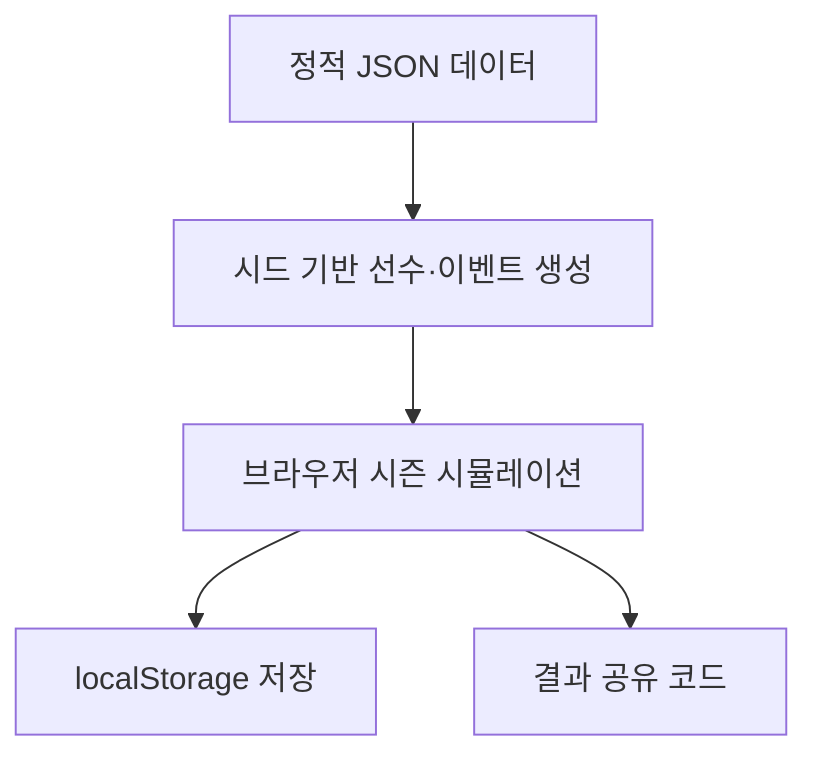

# 10분짜리 한국 프로야구 단장 로그라이크 기획안

> 한국 프로야구에서 영감을 받은, 서버·DB·생성형 AI API 없이 플레이할 수 있는 모바일 우선 웹게임 기획안

## 1. 게임 개요

### 가제

- 《10년 안에 우승》
- 《단장님, 올해는 가을야구 갑니까?》
- 《야구단 생존기》
- 《LAST GM》
- 《페넌트 레이스: 프런트 오피스》

### 한 줄 소개

> 만년 꼴찌 구단의 신임 단장이 되어 매 시즌 세 번의 중요한 결정을 내리고, 제한된 기간 안에 한국시리즈에 해당하는 최종 우승을 달성하라.

### 기본 사양

- 모바일 우선 웹게임
- Vercel 정적 배포
- 회원가입·서버·DB 없음
- 생성형 AI API 없음
- 플레이 기록은 `localStorage`에 저장
- 1회 플레이 8~12분
- 날짜 기반 시드로 일일 도전 제공

## 2. 핵심 재미

1. 제한된 정보로 선수를 평가한다.
2. 지금 우승할지 미래에 투자할지 결정한다.
3. 예상과 다르게 흘러가는 야구의 변수를 감당한다.

좋은 선택이 반드시 좋은 결과를 만들지는 않지만, 장기적으로는 더 높은 기대값을 가져야 한다. 능력뿐 아니라 연봉, 나이, 부상 위험, 팬심과 구단 상황 때문에 선택의 가치가 달라지도록 설계한다.

## 3. 한 판의 흐름

기본 모드는 7시즌으로 구성하고, 10시즌 모드는 해금 콘텐츠로 제공한다.

| 단계 | 내용 | 예상 시간 |
|---|---|---:|
| 구단 선택 | 구단 특성과 초기 목표 선택 | 20초 |
| 프리시즌 | 선수 영입·방출·트레이드 | 시즌당 40초 |
| 시즌 이벤트 | 부상·불화·유망주 등 이벤트 2개 | 시즌당 20초 |
| 시즌 시뮬레이션 | 순위 변화 연출 | 시즌당 10초 |
| 포스트시즌 | 투수 운용 및 라인업 선택 | 진출 시 30초 |
| 시즌 결산 | 성적·팬심·구단주 평가 | 시즌당 10초 |
| 최종 결산 | 단장 등급과 공유 결과 | 30초 |

## 4. 가상 구단 (나는 실제 구단 썻으면 좋겠음...)

초기 버전에서는 실제 구단 대신 독자적인 이름·색상·로고를 가진 가상 구단을 사용한다.

| 구단 | 특징 | 난이도 |
|---|---|---:|
| 서울 피닉스 | 예산은 많지만 선수단이 고령화됨 | 보통 |
| 부산 웨이브스 | 팬덤은 강하지만 성적 압박이 큼 | 어려움 |
| 인천 앵커스 | 타선은 강하지만 투수진이 약함 | 보통 |
| 대전 스파크스 | 최고 수준의 유망주 팜 | 쉬움 |
| 광주 타이거윙스 | 선발진이 강하고 야수층이 얇음 | 보통 |
| 대구 크라운스 | 홈런 타자가 많지만 수비가 약함 | 보통 |
| 수원 유니콘스 | 모든 능력이 평균적 | 쉬움 |
| 창원 다이노스 | 젊지만 경험이 부족함 | 보통 |
| 잠실 트윈스타 | 우승 후보지만 샐러리캡이 꽉 참 | 어려움 |
| 고척 히어로스 | 예산은 적지만 트레이드 효율이 좋음 | 매우 어려움 |

실제 지역 야구의 분위기는 참고하되 기존 구단의 고유 명칭, 로고, 색상 조합 및 유니폼은 그대로 복제하지 않는다.

-- 나는 실제 구단 썻으면 좋겠음...

## 5. 선수 시스템

### 야수 능력치

- 타격
- 장타
- 선구
- 주루
- 수비
- 체력

### 투수 능력치

- 구위
- 제구
- 변화구
- 위기관리
- 체력

### 공통 정보

- 나이
- 연봉과 계약기간
- 잠재력
- 부상 위험
- 성격과 인기도

화면에는 `S/A/B/C/D` 등급으로 표시하고 내부 계산에는 0~100 수치를 사용한다. 일부 정보와 특성은 스카우팅 또는 시즌 진행 후 공개한다.

### 선수 특성 예시

- 큰 경기 체질
- 유리몸
- 이닝이터
- 좌완 킬러
- 클럽하우스 리더
- FA로이드
- 에이징 커브
- 로또형 외국인
- 수비 포지션 다양성
- 프랜차이즈 스타
- 계약 후 태업
- 가을 DNA

## 6. 단장 자원

| 자원 | 역할 |
|---|---|
| 예산 | FA, 외국인 선수, 시설 투자 |
| 팬심 | 수익과 구단주 인내심에 영향 |
| 케미스트리 | 선수단 성적의 안정성 |
| 유망주 팜 | 장기적인 선수 공급 |
| 스카우팅 | 숨겨진 능력 확인 |
| 구단주 신뢰 | 0이 되면 해고 |
| 피로도 | 부상과 포스트시즌 성적에 영향 |

## 7. 시즌 의사결정

매 시즌 중요한 결정 세 번만 직접 내리고 나머지 일반 업무는 자동으로 처리한다.

### 프리시즌

- FA 영입
- 핵심 선수 연장 계약
- 외국인 선수 선택
- 유망주 지명
- 트레이드
- 감독 교체
- 육성 시설 투자

### 시즌 중

- 부상 선수의 조기 복귀
- 부진한 외국인 선수 교체
- 유망주 1군 승격
- 감독과 스타 선수의 갈등 중재
- 마감일 즉시전력 영입
- 시즌 포기 후 베테랑 판매

### 포스트시즌

- 1선발 당겨쓰기
- 마무리 투수의 8회 투입
- 수비형 포수 선발 기용
- 부상 중인 스타 출전
- 불펜 데이 운영

## 8. 로그라이크 구조

플레이할 때마다 선수, 드래프트 클래스, FA 시장, 외국인 후보, 부상, 구단주 요구, 라이벌 구단, 히든 특성과 포스트시즌 결과가 달라진다.

### 시즌 환경 카드

- 타고투저: 장타 가치 상승, 투수 체력 소모 증가
- 투고타저: 수비와 주루 가치 상승
- ABS 도입: 제구형 투수 가치 상승
- 샐러리캡 강화: 고액 계약 부담 증가
- 외국인 쿼터 확대: 스카우팅 가치 상승
- 공인구 변화: 홈런 증가
- 대형 신인 드래프트: 지명권 가치 상승

## 9. 경기 시뮬레이션

모든 타석을 보여주기보다 팀 전력과 경기 결과를 빠르게 계산한다.

```text
득점력 = 타격 + 장타 + 선구 + 주루
실점 억제 = 선발 + 불펜 + 수비
안정성 = 뎁스 + 체력 + 케미스트리
```

선수 성장·노쇠, 부상, 홈구장, 감독 성향, 상대 전력, 일정 운과 시즌 환경 카드를 추가 보정한다. 시즌 진행 화면에서는 날짜와 순위표가 빠르게 변하는 연출을 제공한다.

## 10. 승리·패배 조건

### 기본 승리

- 7시즌 안에 최종 우승

### 추가 목표

- 3년 연속 포스트시즌
- 샐러리캡 초과 없이 우승
- 자체 육성 선수 5명 이상으로 우승
- 최하위 팀으로 3년 내 우승
- 베테랑 중심 선수단으로 우승
- 외국인 선수 없이 우승

### 해고 조건

- 구단주 신뢰 0
- 3년 연속 최하위
- 구단 재정 파산
- 팬심 10 이하
- 구단주 특별 미션 실패

실패하더라도 시즌별 성적과 선택을 정리한 단장 경력표 및 평가 문구를 보여준다.

## 11. 메타 진행과 일일 도전

`localStorage`에 다음 정보를 저장한다.

- 해금된 구단·구단주·시즌 환경 카드
- 업적과 최고 기록
- 발견한 선수 특성 도감
- 일일 도전 기록

영구 능력치 보너스 대신 새로운 규칙과 난이도를 해금하는 방식으로 공정성을 유지한다.

날짜를 난수 시드로 사용하면 서버 없이 모든 이용자에게 동일한 일일 도전을 제공할 수 있다.

```text
seed = 20260916
```

공유 예시:

```text
야구단 생존기 Daily #147
🟨 7위
🟩 4위
🟩 2위
🏆 우승
단장 점수: 8,420
```

## 12. MVP 범위

### 포함

- 가상 구단 4개 (나는 실제 구단 10구단 썻으면 좋겠음...)
- 선수 이름 조합 300개 (나는 실제 선수 엔트리 봤으면 좋겠음..)
- 선수 특성 20개
- 일반 이벤트 40개
- FA·트레이드 이벤트 20개
- 시즌 환경 카드 10개
- 구단주 성향 4개
- 엔딩 12개
- 난이도 3단계
- 7시즌 플레이

### 초기 버전에서 제외

- 직접 타격·투구
- 144경기 상세 박스스코어
- 2군 전체 로스터
- 복잡한 계약 옵션
- 실제 경기 일정
- 온라인 랭킹
- 계정 및 클라우드 저장
- 이용자 간 트레이드

## 13. 기술 구성



### 추천 스택

- Vite + React + TypeScript
- Zustand
- Tailwind CSS
- Zod
- `seedrandom` 또는 자체 PRNG
- `localStorage`
- PWA
- Vercel 정적 배포

### 데이터 구조

```text
/data
  teams.json
  names.json
  traits.json
  events.json
  owners.json
  league-rules.json
```

세이브 데이터에는 마이그레이션을 위한 버전을 포함한다.

```json
{
  "saveVersion": 1,
  "seed": "20260916",
  "season": 4,
  "teamId": "busan-waves"
}
```

## 14. 실제 KBO 명칭·구단·선수 사용 검토

> 아래 내용은 일반적인 실무 위험 판단이며 정식 법률 자문이 아니다.

### 결론

무료·비상업적 배포라고 해서 실제 구단 로고와 선수 프로필 사진을 자유롭게 사용할 수 있는 것은 아니다. 실제 구단명과 선수명은 사진보다 위험이 낮을 수 있지만, 게임의 핵심 콘텐츠와 홍보 수단으로 사용한다면 완전히 안전하다고 단정하기 어렵다.

| 사용 요소 | 무료 팬게임 위험도 | 권장 판단 |
|---|---:|---|
| 야구 규칙·일반적인 단장 시스템 | 낮음 | 사용 가능 |
| 경기 결과·타율 같은 단순 사실 | 비교적 낮음 | 출처·수집 방법 확인 |
| `KBO`를 게임 제목·로고에 사용 | 중상 | 허락 없이는 피하기 |
| 실제 구단명 | 중간 이상 | 가상화 권장 |
| 실제 선수명 | 중간 | 핵심 캐릭터화 시 허락 권장 |
| 선수 프로필 사진 | 높음 | 사용하지 않기 |
| 구단 로고·엠블럼 | 높음 | 사용하지 않기 |
| 고유 유니폼 디자인 | 중상 | 그대로 복제하지 않기 |
| 실제 응원가·음원 | 매우 높음 | 사용하지 않기 |
| KBO 사이트 데이터 대량 복제 | 중상 | 사전 허락 또는 별도 공개 데이터 사용 |

### 비영리 이용

비영리는 침해 여부나 손해액 판단에서 고려될 수 있지만, 모든 무단 이용을 허용하는 포괄적인 예외가 아니다. KBO 홈페이지 약관은 사이트 자료와 관련하여 비영리적인 경우에도 제휴사의 동의를 먼저 얻어야 한다고 밝히고 있다.

- [KBO 홈페이지 이용약관](https://koreabaseball.com/Etc/Policy.aspx)

### 선수 프로필 사진

프로필 사진에는 사진작가·언론사 등 촬영 또는 제작 주체의 저작권과 선수의 초상·인격표지에 관한 권리가 각각 문제될 수 있다. 선수 본인의 허락만으로 사진 저작권까지 자동 해결되는 것도 아니다. KBO 홈페이지의 증명사진을 내려받아 선수 카드에 넣는 방식은 피하는 것이 좋다.

- [한국저작권위원회: 유명인 사진 이용 관련 안내](https://www.copyright.or.kr/customer-center/faq/list.do?categorycode1=&counselfaqno=47772&pageIndex=2&portalcode=&searchkeyword=)

대안:

- 독자적으로 만든 가상 얼굴
- 실제 선수를 식별할 수 없는 캐릭터
- 얼굴 없는 선수 실루엣
- 헬멧·포지션 아이콘
- 등번호와 능력치만 표시
- 가상 선수용 픽셀 아바타

실제 선수와 식별될 정도로 닮은 AI 생성 얼굴도 안전한 우회책이라고 보기 어렵다.

### 선수 이름과 인격표지

단순한 기사·기록표에서 선수를 언급하는 것과 선수 이름을 게임 캐릭터 및 콘텐츠의 흡인력으로 이용하는 것은 성격이 다르다. 현행 부정경쟁방지법은 국내에 널리 알려지고 경제적 가치가 있는 사람의 성명·초상·음성·서명 등 식별표지를 공정한 상거래 관행이나 경쟁질서에 반하는 방법으로 자신의 영업을 위해 무단 사용하여 경제적 이익을 침해하는 행위를 규율한다. 프로 스포츠 선수도 보호 대상이 될 수 있다.

- [국가법령정보센터: 부정경쟁방지 및 영업비밀보호에 관한 법률 제2조](https://www.law.go.kr/LSW//lsSideInfoP.do?docCls=jo&joBrNo=00&joNo=0002&lsiSeq=277201&urlMode=lsScJoRltInfoR)
- [특허청: 유명 스포츠인의 얼굴과 이름 보호 설명](https://kipo.go.kr/ko/kpoBultnDetail.do?aprchId=BUT0000029&menuCd=SCD0200618&ntatcSeq=19495&sysCd=SCD02)

완전 무료 개인 팬게임은 상업 서비스보다 위험이 낮을 수 있으나 다음 요소가 붙으면 위험도가 올라간다.

- 광고·후원 링크
- 유료 버전이나 유료 아이템
- Patreon·멤버십
- 앱스토어 판매
- 게임을 사업 또는 포트폴리오 홍보에 적극 활용
- 실제 선수 이름을 주요 홍보 포인트로 사용
- 공식 상품처럼 보이는 디자인

### 실제 구단명과 KBO 명칭

설명문에서 소재를 언급하는 것과 `KBO GM`, `KBO 매니저`처럼 게임 제목·로고에 공식 명칭을 전면 배치하는 것은 다르다. 공식 서비스로 오인될 만한 명칭과 디자인은 피한다.

권장 설명:

> 한국 프로야구에서 영감을 받은 비공식 가상 야구단 운영 게임

권장 고지:

> 본 게임은 특정 프로야구 단체, 구단 및 선수와 관련이 없는 비공식 창작물입니다.

고지문은 보조 수단이며 이용 허락을 대신하지 않는다.

## 15. 권장 출시 전략

### A안: 완전 가상화 — 권장

- 가상 리그·10개 구단·선수 사용
- 독자적인 로고와 유니폼
- 현실적인 한국식 이름
- 한국 프로야구와 유사한 시즌·포스트시즌 운영 감각

향후 광고나 유료 출시 가능성이 생겨도 콘텐츠를 전면 교체할 필요가 적다.

### B안: 실제 기록을 활용한 무료 팬 프로젝트

- 실제 선수명 사용
- 사진과 구단 로고는 미사용
- 기록의 출처와 이용 조건 확인
- 공식성을 암시하지 않음
- 광고·후원·결제 없음
- 권리자의 삭제 요청을 받을 창구 마련
- 공개 전 KBO 및 관련 권리자에게 서면 문의

### C안: 실제 구단·선수·사진 전부 사용

- KBO 및 구단 라이선스
- 선수 이름·초상 이용 권한
- 사진 저작권자의 허락
- 데이터 이용 계약

개인 팬게임 규모에서는 현실적으로 부담이 크다.

## 16. 최종 권장 방향

> 게임 시스템과 구단 분위기는 한국 프로야구에서 가져오되, 리그·구단·선수·로고·사진은 전부 가상화한다. (나는 사진은 안쓰더라도 실제 이름 및 성적을 사용 했으면 좋겠음...)

실제 권리를 사용하지 않아도 다음 요소로 한국 야구 특유의 정서를 살릴 수 있다.

- 지역별 응원 열기와 원정 압박
- 넓은 구장과 돔구장의 차이
- 외국인 선수 복권
- FA 보상선수
- 군 복무
- 2차 드래프트
- 가을야구 경우의 수
- 감독과 프런트의 갈등
- 모기업 경영 악화

이 방향이 MVP 제작, 공개 배포, 향후 상업화 가능성을 모두 고려했을 때 가장 안전하고 확장성이 높다.
