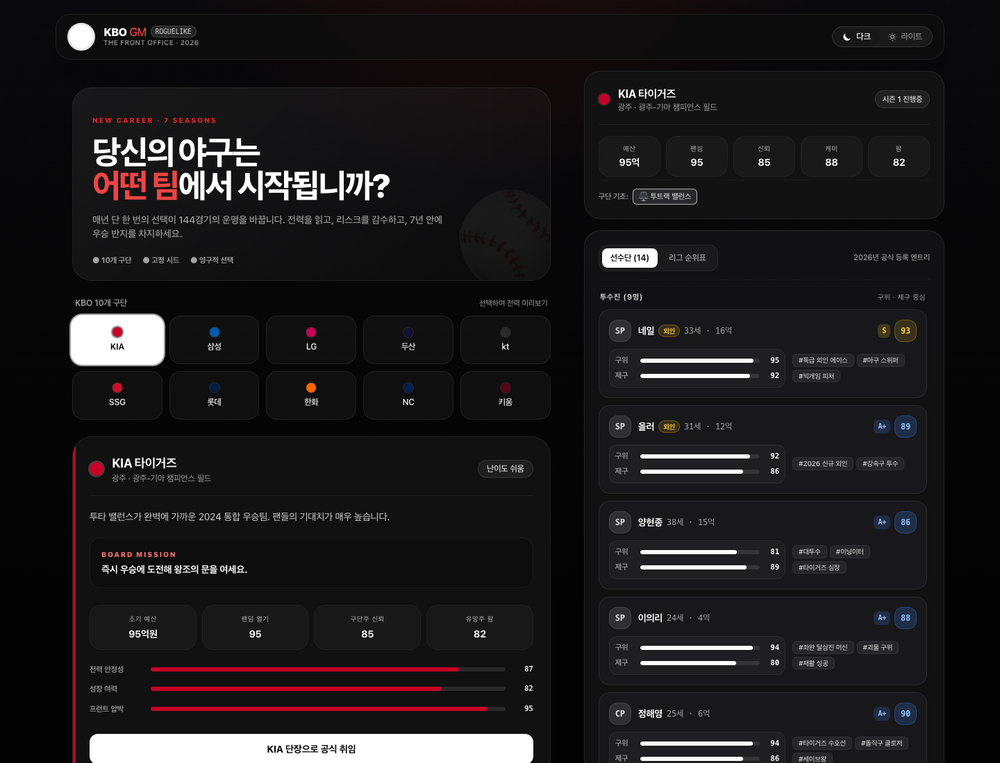

# KBO GM Roguelike

> 한 번의 결정이 144경기의 운명을 바꾼다.

KBO 구단의 단장이 되어 7시즌 동안 선수단을 운영하는 비공식 팬메이드 로그라이크 경영 시뮬레이션입니다. 매 시즌 달라지는 환경과 선수 시장 속에서 로스터를 구성하고, 돌발 상황을 처리하며, 한국시리즈 우승에 도전합니다.

[게임 플레이하기](https://kbo-gm.vercel.app) · [GitHub 저장소](https://github.com/iamminseongKim/kbo-gm)



## 게임의 핵심 개념

KBO GM은 경기 하나하나를 직접 조작하는 야구 게임이 아닙니다. 제한된 예산과 불완전한 정보 안에서 결정을 내리고, 그 선택의 결과를 시즌 전체로 확인하는 단장 시뮬레이션입니다.

- **7시즌 커리어**: 장기적인 왕조 구축과 단기 성적 사이에서 균형을 선택합니다.
- **시드 기반 로그라이크**: 같은 시드는 같은 조건을 만들지만 플레이어의 선택에 따라 결과가 달라집니다.
- **영구적인 결정**: 영입, 방출, 트레이드와 신인 지명이 이후 시즌 선수단에 계속 영향을 줍니다.
- **구단별 난이도**: 예산, 팬심, 구단주 신뢰, 케미스트리와 팜 시스템이 서로 다릅니다.
- **해고 가능성**: 재정 파탄, 장기 부진과 구단주 신뢰 하락은 커리어 종료로 이어질 수 있습니다.

## 한 시즌의 흐름

```text
스토브리그
  → 외국인 계약 및 선수단 정리
  → 스프링캠프
  → 전반기 돌발 사건
  → 72경기 전반기 결산
  → 핵심 선수 부상 대응
  → 외국인 중도 교체
  → 1·2군 엔트리 조정
  → 신인 드래프트
  → 트레이드 마감일
  → 후반기 승부처
  → 144경기 정규시즌
  → 포스트시즌 및 시즌 결산
```

## 주요 시스템

### 로스터와 선수 시장

- 구단별 실제 포지션 구성을 반영한 선수단
- 외국인 및 아시아쿼터 계약
- 시즌별로 중복되지 않는 확장 후보 풀
- 베테랑 방출과 연봉 절감
- 잠재력과 계약금이 다른 신인 드래프트
- 현재 로스터를 기반으로 생성되는 실제 선수 트레이드
- 전반기 부진 외국인의 중도 교체와 잔여 연봉 부담

### 시즌 운영

- 윈나우, 밸런스, 리빌딩 구단 기조
- 타고투저, 투고타저, ABS 등 시즌 환경 변수
- 팬심, 구단주 신뢰, 선수단 케미와 팜 시스템 관리
- 72경기 시점 중간 순위표
- 실제 선수에게 적용되는 부상과 강행 출전 결정
- 라이벌전, 감독 갈등, 팬 시위와 트레이드 마감 등 돌발 사건

### 경기와 포스트시즌

- 구단 전력과 환경을 반영한 144경기 시뮬레이션
- 9회 승부처에서 작전 선택
- 실제 정규시즌 승률과 득실차를 반영한 포스트시즌
- 와일드카드부터 한국시리즈까지 KBO 방식의 가을야구
- 신임 단장 압박과 단기전 전술에 따른 변동성

## 로컬 실행

Node.js 18 이상을 권장합니다.

```bash
npm install
npm run dev
```

프로덕션 빌드:

```bash
npm run build
npm run preview
```

## 기술 구성

- React 18
- TypeScript
- Vite
- Tailwind CSS
- 별도 백엔드 없이 동작하는 시드 기반 PRNG 시뮬레이션
- Vercel 배포

## 프로젝트 성격 및 권리 고지

이 프로젝트는 야구와 KBO 리그를 좋아하는 개인이 제작한 **비공식·비상업적 팬 창작물**입니다.

- KBO 및 각 구단의 공식 게임, 공식 서비스 또는 공식 제휴 프로젝트가 아닙니다.
- KBO, 구단명, 선수명, 엠블럼, 상표와 기타 관련 권리는 각 권리자에게 있습니다.
- 본 프로젝트는 학습, 연구 및 개인적인 팬 활동을 목적으로 하며 상업적으로 이용하지 않습니다.
- 게임 내 정보와 능력치는 실제 기록을 그대로 제공하거나 미래 성적을 보장하지 않는 시뮬레이션용 창작 데이터입니다.
- 권리자의 정당한 수정 또는 삭제 요청이 있을 경우 성실히 검토하고 대응합니다.

소스 코드와 프로젝트 고유 디자인의 저작권은 프로젝트 제작자에게 있습니다. 별도의 명시적 허가 없이 본 프로젝트 또는 그 일부를 복제하여 판매하거나 광고, 유료 서비스, 재배포 등 상업적인 목적으로 이용할 수 없습니다.

## 피드백

버그 제보와 개선 제안은 [GitHub Issues](https://github.com/iamminseongKim/kbo-gm/issues)를 이용해 주세요.

---

Made for baseball fans who still believe one decision can change a season.
